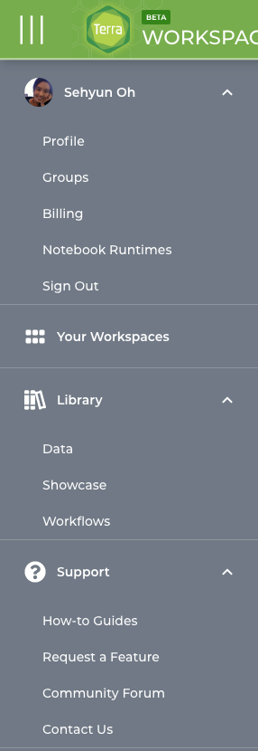
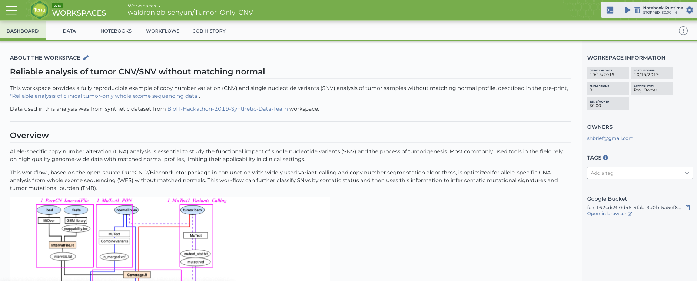
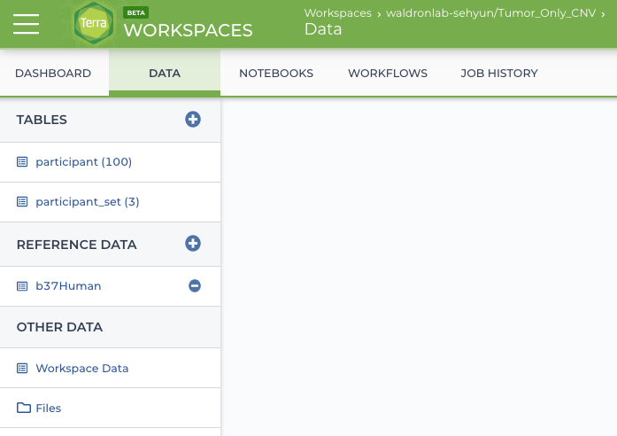
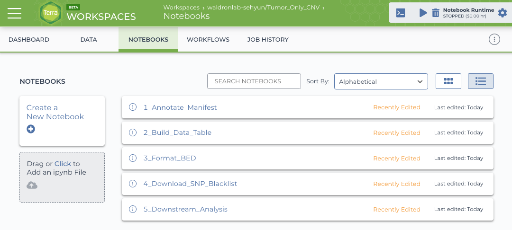
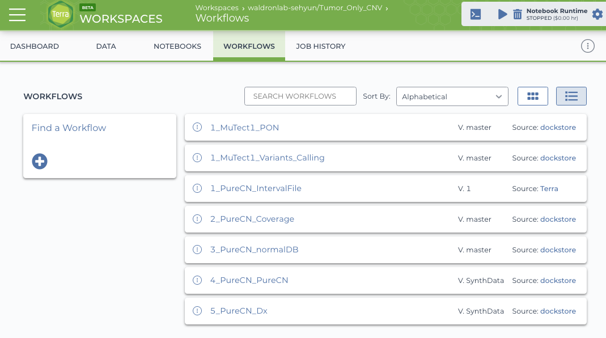
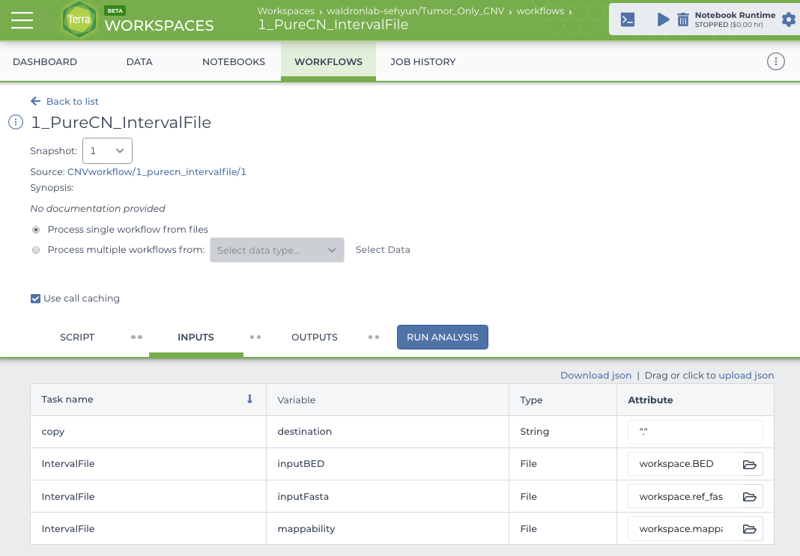
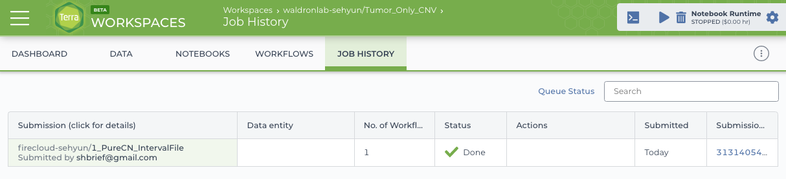
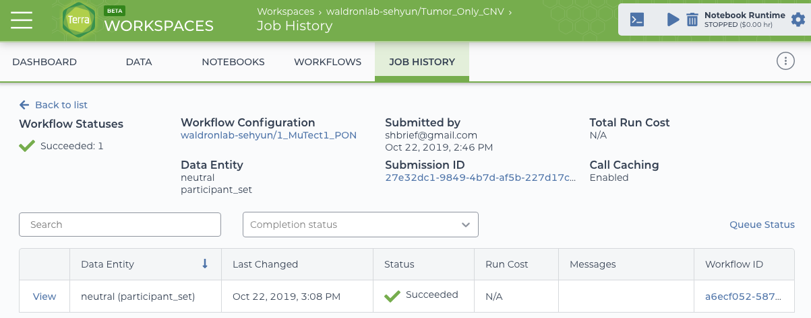
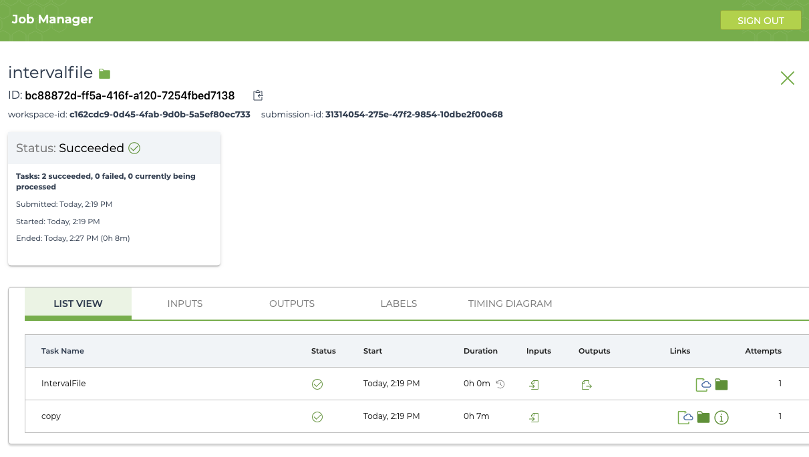

```{r setup, include=FALSE}
knitr::opts_chunk$set(echo = TRUE)
```


# What is Terra?
Terra is a cloud-native platform for biomedical researchers to access data, run analysis tools, and collaborate. Terra powers important scientific projects like FireCloud, AnVIL, and DataSTAGE.   

In this vignette, we assume that you already setup your Terra account and will 
walk through **Tumor_Only_CNV** workspace. 


# Terra Workspace
In the Terra homepage, click the upper left button (with three horizontal lines) and
sign in with your Google account.



_**Your Workspaces**_ section is where you will do the most for your analysis. _**Library**_ section provides the list of available datasets (_**Data**_), example usecases (_**Showcase**_), and workflows (_**Workflows**_).

To access **Tumor_Only_CNV** workspace, click _**Your Workspaces**_ and in the search 
bar on the top, type 'Tumor_Only_CNV'. Currently, workspace publishing 
functionality of Terra is not yet supported, so you can get the access to this 
workspace upon email request, Sehyun.Oh@sph.cuny.edu.


# Workspace Dashboard
Now you are in **Tumor_Only_CNV** workspace!

_**DASHBOARD**_ section starts with an overview of the workspace, followed by 
brief introductions and supplmentary notes on workflows, notebooks, data, and 
runtime environments.




# Workspace Data
In this workspace, we used [a synthetic dataset](https://app.terra.bio/#workspaces/bioit-hackathon/BioIT-Hackathon-2019-Synthetic-Data-Team).
More detailed description on how to use workspace data tables can be found [here](https://support.terra.bio/hc/en-us/articles/360025758392-Managing-data-with-the-data-table-).



# Workspace Notebooks
Currently, this workspace has 5 notebooks: data subsetting steps (notebooks 1 and 2),
pre-processing input files (notebooks 3 and 4), and downstream analysis (notebook 5).



# Workspace Workflows
Currently, this workspace contains 7 workflows with the prefix representing the 
order of processes. For example, three workflows with prefix _**'1_'**_ can be 
run at the same time, because they are not dependent on outputs from other workflows. 



# Running a workflow
Below is the example of running one of the first workflows, _**'1_PureCN_IntervalFile'**_. Once you opened the workflow, it asks you to select several parameters. The default 
inputs/outputs are assigned here and you can modify them manually or by uploading json
file.

## Workflow inputs


## Monitor workflow processing
### Job History after submission
After you provide all the required parameters and click the _**RUN ANALYSIS**_, 
your job will be submitted and you can monitor the process under _**JOB HISTORY**_ 
section. Status will change through *'Submitted > Running > Done'*.


<br>

### Job History after finish  
Below is the example of the succesfully run workflow.

To see the detailed information on the workflow processing and the outputs, click
the workflow name in the first column, _**Submission (click for details)**_. 



<br>

_**View**_ in the first column will direct you to the 'Job Manager' page captured
below and _**Workflow ID**_ in the last column will directly point you to the Google bucket.  



<br>

This includes detailed run information (including the linked Google bucket
address) of each task, and timing diagram. 



